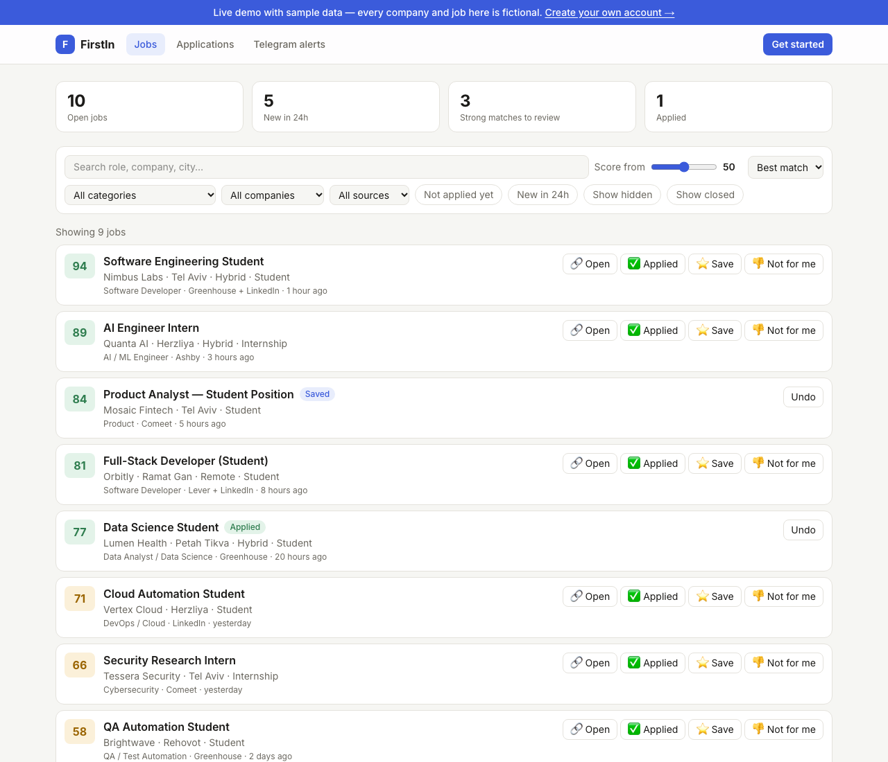
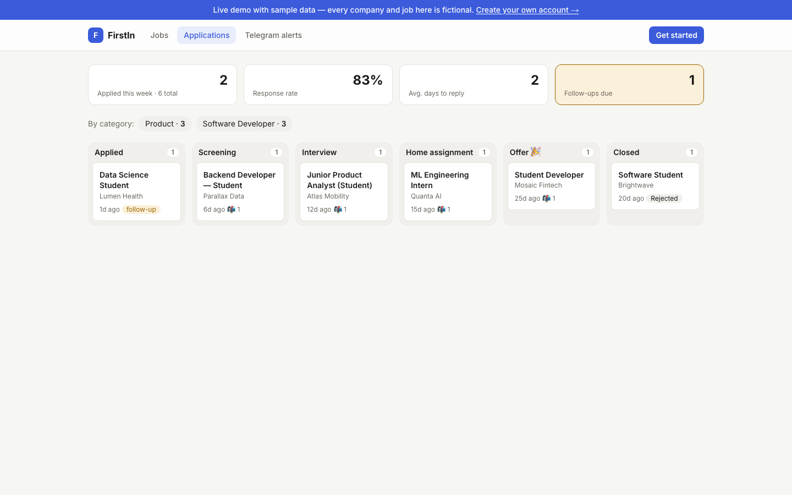
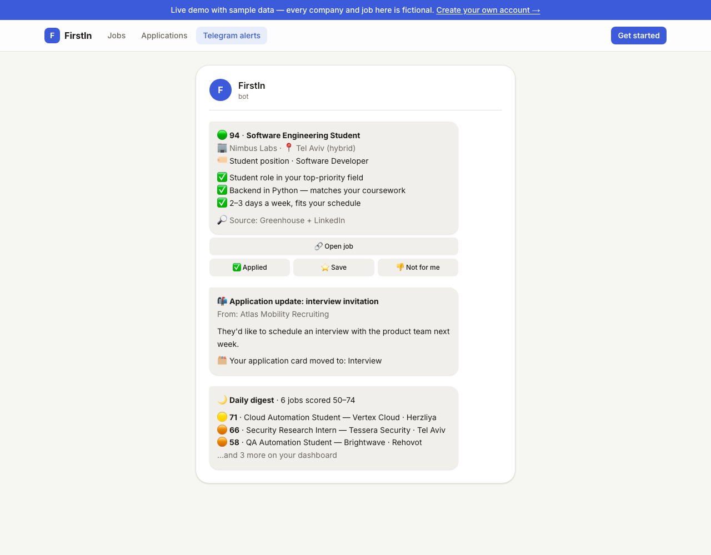
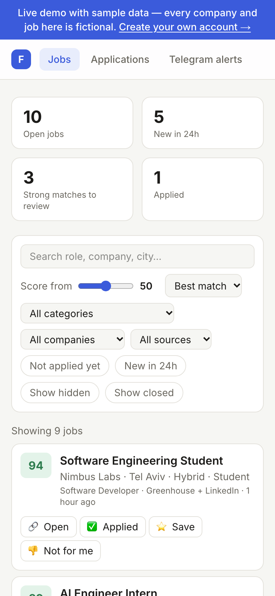
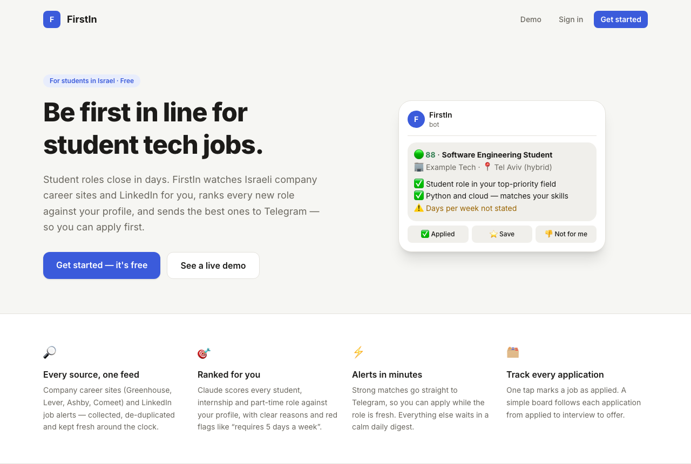

# FirstIn

**A personal job-search agent for student, part-time and internship tech roles in Israel.**

🌐 **Live site:** [firstin-three.vercel.app](https://firstin-three.vercel.app) ·
🎮 **Live demo (no sign-up):** [firstin-three.vercel.app/demo](https://firstin-three.vercel.app/demo)

FirstIn continuously scans company career sites, LinkedIn job alerts and your inbox, filters and
ranks every job against your profile with Claude, and sends the good ones straight to Telegram —
so you can be among the first to apply. A web dashboard keeps every job and application in one place.

> Student jobs in tech close fast — sometimes within days — and they are scattered across LinkedIn,
> dozens of applicant-tracking systems and email. FirstIn collects them into one ranked feed.

---

## Screenshots

> Sample data — every company and job below is fictional. **Click any screenshot to open it in the [live demo](https://firstin-three.vercel.app/demo).**

**Job feed** — every match ranked against your profile, with reasons and red flags
[](https://firstin-three.vercel.app/demo)

**Application tracking** — from applied to offer, updated automatically from email
[](https://firstin-three.vercel.app/demo/applications)

<table>
<tr>
<td width="60%"><b>Telegram alerts</b> — instant matches, application updates and a daily digest<br><a href="https://firstin-three.vercel.app/demo/alerts"></a></td>
<td width="40%"><b>On your phone</b><br><a href="https://firstin-three.vercel.app/demo"></a></td>
</tr>
</table>

**Landing page**
[](https://firstin-three.vercel.app)

---

## Features

**Discovery**
- **Gmail** (read-only): parses LinkedIn Job Alert emails into individual jobs, and classifies other
  mail as recruiter outreach, application updates (received / interview / home assignment / offer /
  rejection) or noise. Non-job mail is never stored.
- **Company career sites** via public ATS endpoints: **Greenhouse, Lever, Ashby and Comeet**.
- **Company auto-discovery**: every unknown company that appears in a job is looked up automatically —
  free token probing first, then a Claude web search — and added to the scan list.
- **De-duplication**: the same job from LinkedIn and from the company's site becomes one record with
  several sources. Jobs that disappear from a career site are marked closed.

**Filtering & ranking**
- A free rule filter first (Israel, student / intern / part-time, no senior or manager roles,
  experience requirements, your cities, remote/hybrid).
- **Claude Sonnet** then scores each remaining job 0–100 against your profile, with short reasons,
  red flags (e.g. "requires 5 days a week") and required skills.

**Notifications (Telegram)**
- Instant alert for strong matches (default score ≥ 75), with buttons: *open*, *applied*, *save*,
  *not relevant* (+ reason, used as feedback).
- Daily digest at 20:00 for medium matches; quiet hours at night.
- Instant alerts for recruiter emails and application updates.
- Write **"סיכום"** or `/summary` to the bot for a summary of the day so far.

**Multi-user**
- Anyone can sign up: a 4-step onboarding (studies, roles in priority order, job types, days a week,
  cities, hybrid/remote) and a one-tap Telegram connection.
- The owner approves each new account from Telegram. Jobs are collected once and shared; scores,
  states, applications and alerts are per user, isolated with Row Level Security.
- Per-user daily scoring quota keeps API costs predictable.

**Dashboard (Next.js)**
- Job feed with search, score slider and filters (category, startup / enterprise, source,
  not applied, last 24 hours), expandable reasons, and the same actions as in Telegram.
- Sign-in with Supabase Auth; database access is restricted by Row Level Security.

**Operations**
- Runs locally on macOS as a background service (launchd) with a scheduler:
  Gmail every 15 min, career sites every hour, digest at 20:00, company discovery daily.
- Health monitoring: a Telegram message if a source fails 3 runs in a row.

---

## Project structure

```
FirstIn/
├── config/                 # Personal settings (only *.example.* files are committed)
│   ├── profile.example.yaml    # education, target roles, cities, days per week
│   ├── settings.example.yaml   # thresholds, quiet hours, sources, extra email senders
│   ├── companies.example.yaml  # seed list of companies
│   └── highlights.example.md   # achievements/projects (for future CV tailoring)
├── worker/                 # Python worker
│   ├── collectors/         # gmail.py, greenhouse.py, lever.py, ashby.py, comeet.py, http.py
│   ├── discovery/          # ATS detector, company finder, companies table
│   ├── emails/             # pre-filter, Claude classifier, LinkedIn alert parser
│   ├── pipeline/           # normalize, rule filter, Claude scorer, ingest (de-dup + save)
│   ├── notify/             # Telegram client, message formatting, alerts/digest, button handler
│   ├── scheduler.py        # the timetable (APScheduler) + Telegram listener
│   ├── run_gmail.py · run_ats.py · run_discovery.py · run_notify.py · rescore.py
│   └── settings.py · db.py · config.py · health.py · models.py
├── dashboard/              # Next.js 16 + Tailwind web app (landing page, demo, onboarding, dashboard)
├── docs/screenshots/       # README images (fictional sample data)
├── db/
│   ├── schema.sql          # Supabase / Postgres schema
│   └── migrations/         # e.g. 001_dashboard_access.sql (RLS for the dashboard)
├── scripts/                # setup_env.py, check_connections.py, gmail_auth.py,
│                           # create_dashboard_user.py, service.sh
├── tests/                  # unittest suite with recorded fixtures (no network)

└── requirements.txt
```

---

## Prerequisites

- **macOS** (the background service uses launchd; the worker itself runs anywhere with Python)
- **Python 3.12** — [python.org](https://www.python.org/downloads/)
- **Node.js 24 LTS** — [nodejs.org](https://nodejs.org/) (only for the dashboard)
- Accounts / keys:
  - **Telegram bot** — create one with [@BotFather](https://t.me/BotFather)
  - **Supabase** project (free tier) — URL, publishable key, secret key
  - **Anthropic API key** — [console.anthropic.com](https://console.anthropic.com/)
  - **Google Cloud OAuth client** (Desktop app) with the Gmail API enabled — download it as
    `config/credentials.json`

---

## Installation

### 1. Clone and create the Python environment

```bash
git clone https://github.com/GiliGerson/FirstIn.git
cd FirstIn
python3.12 -m venv .venv
.venv/bin/pip install -r requirements.txt
```

### 2. Fill in `.env`

All secrets live in `.env`, which is never committed. `.env.example` lists every variable:

| Variable | Where to get it |
|---|---|
| `TELEGRAM_BOT_TOKEN` | @BotFather → `/mybots` → your bot → *API Token* |
| `TELEGRAM_BOT_USERNAME` | your bot's username (filled automatically by the setup script) |
| `TELEGRAM_CHAT_ID` | your chat with the bot (found automatically by the setup script) |
| `SUPABASE_URL` | Supabase → Project Settings → Data API → *Project URL* |
| `SUPABASE_PUBLISHABLE_KEY` | Supabase → Project Settings → API Keys → *Publishable key* |
| `SUPABASE_SECRET_KEY` | Supabase → Project Settings → API Keys → *Secret key* |
| `ANTHROPIC_API_KEY` | console.anthropic.com → API Keys |
| `GMAIL_CREDENTIALS_PATH` / `GMAIL_TOKEN_PATH` | defaults: `config/credentials.json`, `config/token.json` |

The easiest way is the interactive script — it asks for each key with hidden input, validates the
Telegram token and finds your chat ID after you message the bot:

```bash
python3 scripts/setup_env.py
```

Or copy the template and edit it by hand: `cp .env.example .env`.

### 3. Create the database

In Supabase → **SQL Editor**, run [`db/schema.sql`](db/schema.sql), then
[`db/migrations/001_dashboard_access.sql`](db/migrations/001_dashboard_access.sql).

### 4. Your profile and settings

```bash
cp config/profile.example.yaml config/profile.yaml
cp config/settings.example.yaml config/settings.yaml
cp config/companies.example.yaml config/companies.yaml
```

Edit them (see [Changing the search settings](#changing-the-search-settings)).

### 5. Connect Gmail and check everything

```bash
.venv/bin/python scripts/gmail_auth.py      # opens the browser once; read-only scope
python3 scripts/check_connections.py        # Supabase, Telegram ("FirstIn מחובר ✅"), Claude
```

---

## Running

**As a background service (recommended on macOS)** — starts at login and restarts on failure:

```bash
scripts/service.sh install     # install + start
scripts/service.sh status      # is it running?
scripts/service.sh logs        # follow logs/worker.log
scripts/service.sh restart
scripts/service.sh stop        # stop and remove from login
```

**In the foreground:** `.venv/bin/python -m worker.scheduler`

**Single runs (useful for testing):**

```bash
.venv/bin/python -m worker.run_gmail --days 14 --preview   # scan mail without writing to the DB
.venv/bin/python -m worker.run_discovery                   # find career sites for new companies
.venv/bin/python -m worker.run_ats                         # scan career sites and ingest jobs
.venv/bin/python -m worker.run_notify                      # send pending alerts
.venv/bin/python -m worker.run_notify --digest             # send the daily digest now
.venv/bin/python -m worker.rescore --all                   # re-score open jobs after changes
```

**Dashboard:**

```bash
python3 scripts/create_dashboard_user.py    # your login (password via hidden input)
cd dashboard
cp .env.example .env.local                  # Supabase URL + publishable key
npm install
npm run dev                                 # http://localhost:3000
```

It can also be deployed to Vercel (set the two `NEXT_PUBLIC_SUPABASE_*` variables there).

**Tests:** `.venv/bin/python -m unittest discover tests`

---

## Changing the search settings

The YAML files in `config/` are only the **initial seed**. On first run they are copied into the
`search_settings` table in Supabase, which is the source of truth from then on.

| What | Where |
|---|---|
| Target roles (priority order), cities, hybrid / remote, max days per week, job types | `config/profile.yaml` (seed) → `search_settings` |
| Include / exclude keywords, instant & digest thresholds, quiet hours, sources | `config/settings.yaml` (seed) → `search_settings` |
| Extra email senders that are always job-related (e.g. your university's career center) | `config/settings.yaml` → `email.extra_known_senders` |
| Companies to scan, favorites (score bonus) | `config/companies.yaml` (seed) and the `companies` table (`priority`: `favorite` / `normal` / `blocked`) |
| Education, study year, languages (used in the scoring prompt) | `config/profile.yaml` |

After changing the active settings in Supabase (Table Editor → `search_settings`), the next run uses
them. To re-rank jobs you already have: `.venv/bin/python -m worker.rescore --all`.
A settings screen in the dashboard and Telegram commands are on the roadmap.

---

## Privacy & security

- Gmail access is **read-only**; FirstIn never sends or deletes mail, and non-job emails are not stored.
- Secrets live only in `.env` / `dashboard/.env.local`; personal config files are git-ignored.
- The Telegram bot only responds to the configured chat ID.
- The dashboard uses Supabase Auth, and every table is protected by Row Level Security.
- The scorer never invents experience; applications are always submitted by you.

---

## Tech stack

Python 3.12 · Supabase (Postgres, Auth, RLS) · Claude API (Sonnet 5.5 for scoring, Haiku 4.5 for
email classification and company search) · Telegram Bot API · Gmail API · APScheduler · launchd ·
Next.js 16 · Tailwind CSS 4

---

## About

This project was built as part of the final project in the course
**"Autodidacticism in the 21st Century"** at the **Adelson School of Entrepreneurship,
Reichman University**.
